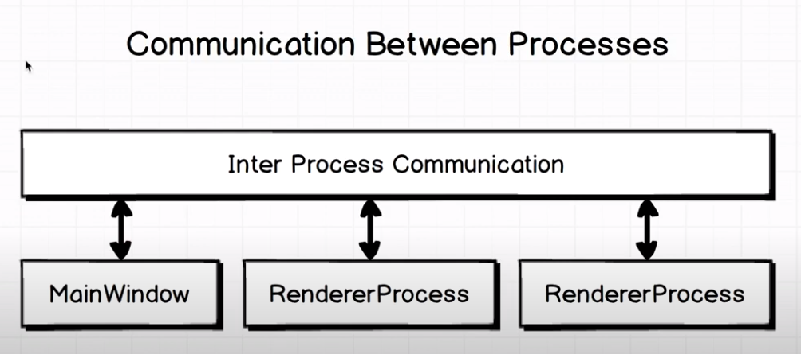

# How does electron work?

### 내부적으로 어떻게 동작하는가?

Electron은 Google Chrome과 거의 비슷하게 동작한다.

Google Chrome과 Activity Monitor를 열고 보면, Google Chrome과 수많은 Google Chrome Helper가 있다.

크롬에서 여러개의 탭을 열면 Google Chrome Helper가 더 생긴다.

Browser Process는 실제 구글 크롬 윈도우를 실행시키는 메인 프로세스다. 각각의 탭은 child process다.

왜 이런 형태의 구조를 만들었을까? 더 나은 캡슐화를 위해. 각 탭을 별도의 프로세스로 분리해서 전체 OS에 미치는 영향을 분리하기 위해. 보안 관점에서 구현. 

이런 하위 탭을 하위 브라우저 또는 RendererProcess라고 한다.

우리가 생성하는 또는 크롬이 생성하는 이런 프로세스는 너무 분리되어 있어서 서로 통신할 수 없는 대신 프로세스 간 통신(IPC)를 사용해 통신한다.

### 그래서 Electron은 어떻게 동작하는가?

Electron은 바로 이 브라우저와 동일하게 동작한다.

내부를 들여다보면 바로 이 chromium 기반의 오픈소스 프로젝트를 사용하고 있다.

따라서 Electron이 동작할 때, 크롬 브라우저가 작동하는 방식이 그대로 적용된다.

Electron에서 객체나 프로세스를 생성하고, 메인 윈도우를 생성하고 여러개의 child RendererProcess를 생성하고 사용자에게 별도의 창을 표시한다.

Electron 앱은 원하는 만큼 RendererProcess를 생성할 수 있고, 각 윈도우의 통신은 IPC를 통해 이루어진다.

