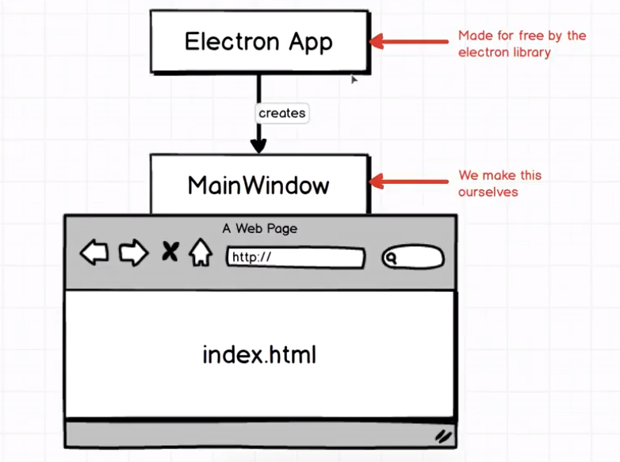
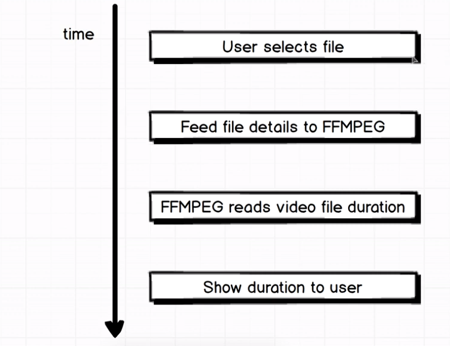
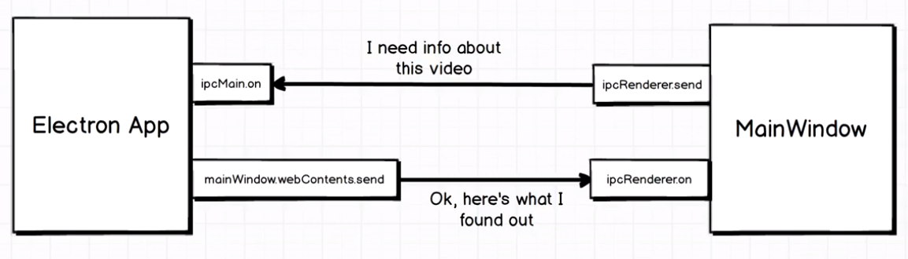

## Getting started

- npm init

  - package.json에 종속성 기록

- electron 설치

  ```
  npm install --save electron
  ```

- index.js 생성

- 두가지 방식으로 electron을 가져올 수 있음

  ```javascript
  // node.js에서 익숙 (es6 지원 안함)
  const electron = require('electron');
  
  // fe에서 익숙 (=es6 module)
  import electron from 'electron';
  ```

## Starting And Stopping Electron

- electron 라이브러리는 일반적으로 electron과 상호작용하는 메인 윈도우다.

- 그 중 app 객체는 electron의 lifecycle을 관리

- lifecycle
  1. Electron 시작
  2. app process 생성
  3. app이 무언가를 할 준비가 됨 (이벤트)
  4. app 닫힘

- 이벤트 작성. 

  ```javascript
  app.on('ready', () => {
      
  });
  ```

- 앱을 시작하는 방법

  scripts 섹션에 다음 코드 추가

  ```javascript
  "electron": "electron ."
  ```

  electron은 기본적으로 index.js를 실행시키려고 하므로 별도로 index.js를 지정해줄 필요는 없다.

  터미널에서 `npm run electron` 실행

- 

  일반적으로 app은 사용자에게 보여지는 창이나 콘텐츠를 담당하지는 않기 때문에 별도로 새로운 창을 만들어야 한다.

  또한 해당 어플리케이션을 닫는 방법을 만들어야 한다.

## Loading html docs

- 창을 만드려면 BrowserWindow 객체가 필요하다.

  ```javascript
  const { app, BrowserWindow } = electron;
  
  app.on('ready', () => {
  	new BrowserWindow({});
  });
  ```

- 창 안에 뭔가 띄우려면 index.html 파일을 만들고 연결해야 한다.

  ```javascript
  app.on('ready', () => {
  	const mainWindow = new BrowserWindow({});
  	mainWindow.loadURL(`file://${__dirname}/index.html`);
  });
  ```

## Selecting videos

- index.html  파일의 내용이 electron 앱에 뜬다.

- index.html 코드를 변경할 때는 앱을 다시시작하지 않아도 된다. (F5면 충분) Electron 관련 코드를 수정할 때만 재시작하면 된다.

- 파일선택 시 웹페이지와 Electron의 차이

  - 웹 페이지 : 유저가 선택한 파일에 대한 세부정보만 얻을 수 있다.
  - Electron : 어떤 임의의 파일이라도 읽을 권한이 있다.

  ```html
  <input type="file" accept="video/*" />
  ```

  이렇게 하면 정해진 video 파일외에는 선택할 수 없다.

## Reading file details

- submit 버튼을 추가하고, 그에 대한 submit JS 코드를 작성하고, 파일의 세부정보를 읽고, 어떻게든 비디오 파일의 길이를 전달한다.  가 로직
- submit 이벤트 메서드에서 파일의 세부정보를 읽어보지만 파일의 경로나 이름, 수정날짜만 나올뿐 비디오의 길이에 대한 정보는 찾을 수 없다.

## Introduction to ffmpeg

- command line tool, ffmpeg라는 도구를 쓸거임

  - 비디오 및 오디오 파일 작업에 사용되는 엄청 인기있는 도구
  - 비디오 파일 변환, 병합 등의 작업을 할 수 있다.

- ffmpeg, ffmpeg fluent 설치 (fluent는 ffmpeg의 래퍼로 nodejs에서 더 쉽게 사용할 수 있도록 만든 도구임)

  ```
  npm install --save fluent-ffmpeg
  ```

## Require statements in the browser

- 
  - 사용자가 파일 선택
  - 파일 세부사항이 fluent-ffmpeg로 넘어감
  - fluent-ffmpeg가 비디오 파일 길이를 읽음
  - 유저에게 반환
- 웹 방식과 Electron 방식 중 어떤 것을 사용할 것인가?
  
- MainWindow가 Electron App에 비디오 파일 정보 요청 -> Electron App에서 찾아서 전달 (IPC)
  
- ```javascript
  const electron = require('electron');
  ```

  HTML script에서 이와 같은 코드를 작성하면, nodejs는 브라우저가 아니므로 크롬 브라우저는 `require`가 무엇인지 원래는 알지 못한다. 하지만 이런 제한은 Electron을 사용할 때 없어진다.

  Electron App에서 실행된 브라우저 창의 콘솔에 `require`을 입력하면 뜬다.ㅎㅎ

- ipcRenderer 선언.

  ipcRenderer 객체는 html문서를 실행중인 브라우저 창에서 Electron과 통신할 수 있게 해준다.

## Ipc communication

- html에서 입력받은 파일의 경로만을 따서 Electron으로 전송한다.

  ```javascript
  const { path } = document.querySelector('input').files[0];
  
  ipcRenderer.send('video:submit', path);
  ```

- ipcRenderer 객체가 작동하는 방식
  
- Electron 쪽에서 ipcMain으로 해당 이벤트를 받는 코드 작성

## Video duration with ffprobe

- 실행하는데 `Uncaught ReferenceError: require is not defined` 발생
  - [Build a Desktop App with Electron in 11 minutes](../electron-tasting/README.md)의 13번 참고
- 또한 실행해서 Get Info 클릭했더니 다음과 같은 오류 발생 `Type Error: Cannot read property 'format' of undefined.`
  - 윈도우에 ffmpeg가 설치되어 있어야 한다...
  - [블로그 가이드](https://blog.naver.com/chandong83/222095346417) 참고

## Receiving ipc events

- `mainWindow.webContents.send()` 를 사용해 브라우저 쪽으로 데이터 전송

