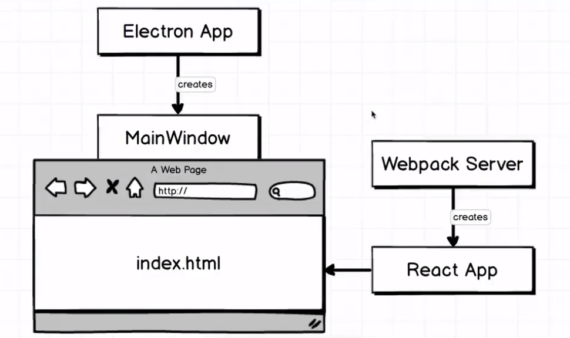

## Status tray application overview

- 시스템 트레이에서 아이콘 클릭하면 창 열림
- 윈도우와 맥 양쪽에서 다 작동
  - 창이 열리는 위치는 다름 (윈도우는 하단, 맥은 상단)
- 

## Browser window vs Tray

- 

- 트레이 아이콘과 브라우저 윈도우 2개의 객체를 만들어서 연결해야 한다.

## Browser window configuration

- 트레이 창은 상단의 메뉴바도 보이지 않아야하고, 움직일 수도, 크기를 조절할 수도 없어야 한다.

- 다음과 같은 브라우저 설정을 통해 이를 가능하게 할 수 있다.

  ```javascript
  app.on('ready', () => {
      mainWindow = new BrowserWindow({
          height: 500,
          width: 300,
          frame: false,
          resize: false,
      });
  });
  ```

## Creating tray icons

- 운영체제에 따라 트레이 아이콘을 만든다.

- Tray 객체를 가져오고

  ```javascript
  const { app,  BrowserWindow, Tray } = electron;
  ```

- 처음 프로그램이 실행될 때, 트레이가 만들어지도록 한다.

  ```javascript
  new Tray();
  ```

- 그리고 운영체제에 따라 다른 아이콘 이미지를 적용하도록 한다.

  ```javascript
  const iconName = process.platform === 'win32' ? 'windows-icon.png' : 'iconTemplate.png';
  const iconPath = path.join(__dirname, `./src/assets/${iconName}`);
  new Tray(iconPath);
  ```

## Toggling browser window visibility

- 앱을 실행시켰을 때 창이 뜨게 하지 않고, 트레이 아이콘을 클릭했을때만 뜨게하고 싶음.

- 프로그램을 실행시켰을때 브라우저 창이 표시되지 않도록 옵션을 설정한다.

  ```javascript
  app.on('ready', () => {
      mainWindow = new BrowserWindow({
          height: 500,
          width: 300,
          frame: false,
          resize: false,
          show: false,
      });
  });
  ```

- 트레이 아이콘을 클릭할 때마다 브라우저 창이 뜨도록 한다.

- tray 변수를 만들어 트레이 객체를 할당하고, click 이벤트를 추가

  ```javascript
  tray = new Tray(iconPath);
  tray.on('click', () => {
      mainWindow.show();
  });
  ```

## Detecting visibility

- 트레이 아이콘을 클릭하면 브라우저 창을 껐다 켰다 할 수 있도록 로직 추가

  ```javascript
  tray.on('click', () => {
      if(mainWindow.isVisible()) {
          mainWindow.hide();
      } else {
          mainWindow.show();
      }
  });
  ```

## The positioning bounds system

- 아이콘 근처로 위치를 변경해보자. (윈도우는 하단, 맥은 상단)
- bound system에서 bound랑 요소의 위치를 의미.
- click 이벤트에서 bounds를 받아서 출력하면 트레이 아이콘을 클릭할 때마다 마우스의 위치가 뜬다.
- click이벤트의 bound가 있고 window의 bound가 있는데 트레이 아이콘 바로 아래 또는 바로 위에 띄우려면,
  - 바로 아래(Mac) : [click이벤트의 x bound - window의 x bound 절반, click이벤트의 y bound]
  - 바로 위(Window) : [click이벤트의 x bound - window의 x bound 절반, click이벤트의 y bound - window의 y bound]

## Setting position with bounds

- ```javascript
  tray.on('click', (event, bounds) => {
      const { x, y } = bounds;
      const { height, width } = mainWindow.getBounds();
      
      if(mainWindow.isVisible()) {
          mainWindow.hide();
      } else {
          mainWindow.setBounds({
              x: x - width/2,
              y,
              height,
              width,
          });
          mainWindow.show();
      }
  });
  ```

- 이러면 Mac에서 트레이 아이콘 바로 밑에 뜸

## Positioning of windows

- 윈도우에서도 다르게 작동하도록 해보자. 차이는 y position뿐이다.

- ```javascript
  else {
      const yPosition = process.platform === 'darwin' ? y : y - height
      mainWindow.setBounds({
          x: x - width/2,
          y: yPosition,
          height,
          width,
      });
     mainWindow.show();
  }
  ```

